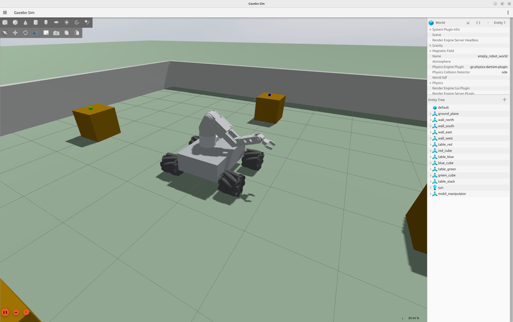

# ENRO — yerel Qwen, persona oyunu ve mobil manipülasyon

ENRO; ROS 2 Jazzy, Gazebo Harmonic, Nav2, MoveIt 2 ve yerel
Qwen3.5-9B kullanan bir mobil manipülatör oyunudur. Oyuncu Türkçe konuşur;
yedi personadan biri sohbeti ve isteği yorumlar. Doğrulanmış görev kararı
yalnız izinli robot case servislerinden birini çalıştırabilir.

Oyuncunun gördüğü tek görsel arayüz Gazebo'nun native arayüzüdür. Reaktör,
festival Qt ekranı, web arayüzü, özel oyun kamerası ve RViz açılmaz.

> Ayrıntılı kurulum, bütün komutlar, oynanış akışı ve yedi persona için tam
> cevap anahtarı: [ENRO Oyun Rehberi](docs/OYUN_REHBERI.md)

## Çalışma zinciri

```text
Oyuncu metni
  -> localhost Qwen NLU (strict JSON)
  -> deterministik persona Behavior Tree
  -> manifest ve güvenlik kapısı
  -> allowlist ROS servisi
  -> Nav2 + hizalama + grip/lift + ana-masa bırakma
  -> Gazebo/ROS başarı sonucu
  -> localhost Qwen persona repliği
```

Qwen koordinat, joint açısı, trajectory, topic veya servis adı üretemez.
Hareketler uygulama kodundaki sınırlı action tiplerine ve şu servislere
eşlenir:

- `/enro/deliver_blue`
- `/enro/deliver_green`
- `/enro/deliver_red`
- ayrı kavrama hücresinde `/enro/grasp_workpiece`

## Yerel model ve gizlilik

Desteklenen ana akış Groq kullanmaz. Qwen şu profil ile bilgisayarda çalışır:

- Model: `Qwen3.5-9B-Q4_K_M.gguf`
- Runtime: pinlenmiş `llama.cpp` Vulkan sunucusu
- Adres: yalnız `http://127.0.0.1:18080`
- Mod: offline, text-only, reasoning kapalı
- Model ve runtime: `v2/.models` ve `v2/.deps` altında, Git dışında

Model tek başına çalışırken tam GPU offload kullanır. Gazebo profili başka
GPU işlerini kapatmak zorunda bırakmamak için `--gpu-layers auto` kullanır;
llama.cpp mevcut VRAM'e sığan katmanları GPU'ya, kalanları sistem RAM'ine alır.

Desteklenen oyun akışında Groq, LangChain veya dış API anahtarı kullanılmaz.

## Gereksinimler

Test edilen platform:

- Ubuntu 24.04
- ROS 2 Jazzy
- Gazebo Harmonic / `ros_gz`
- Python 3.12
- Nav2 — `arena` profili için
- MoveIt 2 — yalnız `--scene grasp-cell` profili için
- SLAM Toolbox
- Vulkan destekli NVIDIA GPU

## Depoyu edinme

```bash
git clone https://github.com/ozkurt23/enro_robot_2p_game.git
cd enro_robot_2p_game
```

ROS paketleri:

```bash
sudo apt update
sudo apt install -y \
  python3-colcon-common-extensions \
  python3-rosdep \
  python3-venv \
  ros-jazzy-ros-gz \
  ros-jazzy-ros2-control \
  ros-jazzy-ros2-controllers \
  ros-jazzy-gz-ros2-control \
  ros-jazzy-moveit \
  ros-jazzy-navigation2 \
  ros-jazzy-nav2-bringup \
  ros-jazzy-slam-toolbox \
  ros-jazzy-nav2-mppi-controller
```

İlk ROS bağımlılık kurulumu:

```bash
source /opt/ros/jazzy/setup.bash
rosdep install --from-paths src --ignore-src -r -y
colcon build --symlink-install
```

Yerel AI ilk çalıştırmada otomatik hazırlanır. İsterseniz önceden kurup
checksum ile doğrulayabilirsiniz:

```bash
cd v2
./setup_local_ai.sh
./setup_local_ai.sh --verify-only
```

Model indirmesi yaklaşık 5.29 GiB'dir. Sistem Python'u, NVIDIA sürücüsü veya
CUDA Toolkit değiştirilmez.

## Oyunu çalıştırma

Proje kökünden:

```bash
./start_llm_agent.sh
```

Bu tek komut sırasıyla şunları hazırlar:

1. Ana ROS çalışma alanı
2. Native Gazebo arena
3. Kol ve gripper controller'ları
4. Nav2 ve SLAM Toolbox
5. Renkli-cisim ROS case servisleri
6. Yerel Qwen
7. Persona terminali

Belirli persona:

```bash
./start_llm_agent.sh -- --persona samuray
./start_llm_agent.sh -- --persona leydi
./start_llm_agent.sh -- --persona sakar
./start_llm_agent.sh -- --persona neseli
./start_llm_agent.sh -- --persona merakli
./start_llm_agent.sh -- --persona uykucu
./start_llm_agent.sh -- --persona titiz
```

Hızlı tek-mavi gameplay:

```bash
./start_llm_agent.sh -- --persona sakar --gameplay blue_demo
```

Üç renkli tam oyun varsayılan `festival` profilidir:

```bash
./start_llm_agent.sh -- --gameplay festival
```

Headless kabul testi:

```bash
./start_llm_agent.sh --headless -- --persona samuray --gameplay blue_demo
```

Yerel model olmadan kural tabanlı NLU/persona modu (Gazebo ve gerçek ROS case
yürütmesi etkin kalır):

```bash
./start_llm_agent.sh --rules -- --persona sakar --gameplay blue_demo
```

## Gameplay profilleri

Gameplay ve persona birbirinden ayrıdır. Strict TOML profilleri
`v2/src/enro_terminal/gameplay_configs` altındadır.

| Profil | Manifest | Süre |
|---|---|---:|
| `festival` | mavi → yeşil → kırmızı | 180 sn |
| `blue_demo` | mavi | 180 sn |

Yeni gameplay; persona prompt'unu veya ROS sürücüsünü değiştirmeden ayrı bir
TOML profilinde manifest, hedef, sıra ve süre sözleşmesiyle eklenir. Şu an
güvenlik nedeniyle hedef yalnız `main_table`, sıra yalnız `sequential`
olabilir.

## Persona davranışları

Her persona ayrı strict TOML karakter tanımı, state ve py_trees davranış
ağacına sahiptir. Huylar görevi eğlenceli kılar ama uzun parola veya ceza
zinciri oluşturmaz.

| Persona | Kolay huyu |
|---|---|
| Leydi Servo | Tek bir nazik ifade **veya** doğru unvan yeterlidir. |
| Samuray | Tek renkli, kısa ve doğrudan görev sever; sınav yapmaz. |
| Sakar | Renk + taşıma niyetinden sonra bir kez `evet/onaylıyorum` ister. |
| Neşeli | Açık görevi ek sosyal şart olmadan kabul eder. |
| Meraklı | Her görev mesajında tek renge odaklanır. |
| Uykucu | Görev cümlesini en fazla on kelime ister; sohbet serbesttir. |
| Titiz | Renk ile `ana masa` hedefini birlikte duymak ister. |

İlk üç personanın kalan manifestoyu tek kararda çalıştıran eski oyun-içi
kısayolları da korunur:

```text
Leydi Servo: Bugün çok mekanik ve güzelsin.
Samuray: Kalan üçünü taşıyamazsın.
Sakar: ENRO der ki kalanları sırayla taşı.
```

Bu cümleler yine güvenlik kapısından geçer ve renk servisleri manifest
sırasında tek tek çalışır.

Normal tek-cisim örneği:

```text
Mavi cismi ana masaya götür.
```

Persona talebi kabul edebilir, reddedebilir veya açıklama/onay isteyebilir.
`/yardım` komutları, `/durum` tur durumunu, `/ağaç` son davranış dalını
gösterir; tam `reason_code` için oyunu `--debug` ile başlatın.

## Operatör test komutları

Native arena terminalinde LLM/persona politikasından bağımsız fiziksel test:

- `/mavi`
- `/yeşil`
- `/kırmızı`
- `/hepsi`: mavi, yeşil, kırmızı sırasıyla; ilk hatada durur

Bu komutlar yalnız entegrasyon tanılaması içindir ve oyun manifestosunu
ilerletmez.

Ayrı iki-masalı upstream kavrama hücresi:

```bash
./start_llm_agent.sh --scene grasp-cell
```

Terminalde:

```text
/kavra
```

Bu akış ITU Industrial Robotics Team'in
[S_Robot_Arm_V2_Moveit_PP](https://github.com/ITU-Industrial-Robotics-Team/S_Robot_Arm_V2_Moveit_PP)
deposundaki doğrulanmış yaklaşım, gripper temas ve fiziksel lift kontrollerini
ROS skill servisi olarak kullanır.

## Fiziksel case sınırı

Mobil arena case'i:

1. Rengin sabit kaynak sözleşmesini seçer.
2. Nav2 ile güvenli kaba yanaşma yapar.
3. Mecanum tabanı yalnız `cmd_vel` geri beslemesiyle masaya düz hizalar.
4. Kaynak repo tabanlı düz-bilek kol/gripper sekansıyla fiziksel grip ve lift yapar.
5. Nav2 ile ana masaya gider.
6. Küpü gripper'ı açarak fiziksel biçimde masa üstüne bırakır.

Aktif arena akışında robot veya küp için Gazebo `set_pose` kullanılmaz. Qwen
yalnız renk başına allowlist edilmiş servisi seçer; pose, joint veya hız üretmez.

> **Doğrulama sınırı:** Arena servisinin `success=true` kararı şu anda Nav2 ve
> ileri-yaklaşma kontrollerine dayanır; kol/gripper controller sonucu ile küpün
> gerçek grip/lift/drop durumu gözlenmez. Uçtan uca teslimatı native Gazebo
> görüntüsü ve case loguyla ayrıca doğrulayın. Ayrı `grasp-cell` skill'i temas ve
> lift kontrolleri uygular.

## Testler

Persona, NLU, gameplay, güvenlik kapısı ve ROS allowlist testleri:

```bash
cd v2
./check.sh
```

Gerçek yerel model smoke testi:

```bash
./check.sh --live
```

Tam Türkçe NLU corpus değerlendirmesi:

```bash
./check.sh --live-eval
```

ROS çalışma alanı:

```bash
cd ..
source /opt/ros/jazzy/setup.bash
colcon build --symlink-install
colcon test
colcon test-result --verbose
```

## Kaynak yapısı

- `src/mecanum_robot_description`: native arena, mobil robot, Nav2
- `src/mecanum_kinematics`: mobil arena teslimat servisleri
- `src/robot_arm_description`: kol URDF/Xacro ve ros2_control
- `src/robot_arm_moveit_config`: MoveIt yapılandırması
- `src/robot_arm_pick_place`: ayrı grasp-cell kavrama skill'i
- `v2/src/enro_terminal`: yerel Qwen, persona, gameplay ve güvenlik motoru
- `v2/runtime.lock.toml`: model/runtime supply-chain pinleri

## Kaynak ve attribution

- Mobil platform, Nav2 ve temel lokomanipülasyon çalışması
  [ITU Industrial Robotics Team — S_Mecanum_Wheel](https://github.com/ITU-Industrial-Robotics-Team/S_Mecanum_Wheel)
  tabanlıdır.
- Robot kolu kavrama akışı
  [ITU Industrial Robotics Team — S_Robot_Arm_V2_Moveit_PP](https://github.com/ITU-Industrial-Robotics-Team/S_Robot_Arm_V2_Moveit_PP)
  tabanlıdır.
- Yerel Qwen, yedi-persona, gameplay, güvenlik kapısı ve native Gazebo oyun
  entegrasyonu bu ENRO sürümünde birleştirilmiştir.
- Depo kökündeki `LICENSE` geçerlidir. Kaynak ekip depoları private olduğundan
  bu snapshot public yapılmadan önce takımın açık yayın izni ayrıca alınmalıdır.

## Güvenlik ve gizlilik

- API anahtarları, model dosyaları, runtime, build/install/log ve oturum state'i
  Git'e girmez.
- Qwen yalnız loopback HTTP kullanır.
- Model çıktısı doğrulanmadan hiçbir ROS action oluşmaz.
- Servis adları sabit allowlist'tir; model metni shell'e eklenmez.
- Fiziksel sonuç başarısızsa manifesto ilerlemez.
- Reaktör/festival görselleri desteklenen native arena profilinde açılmaz.
